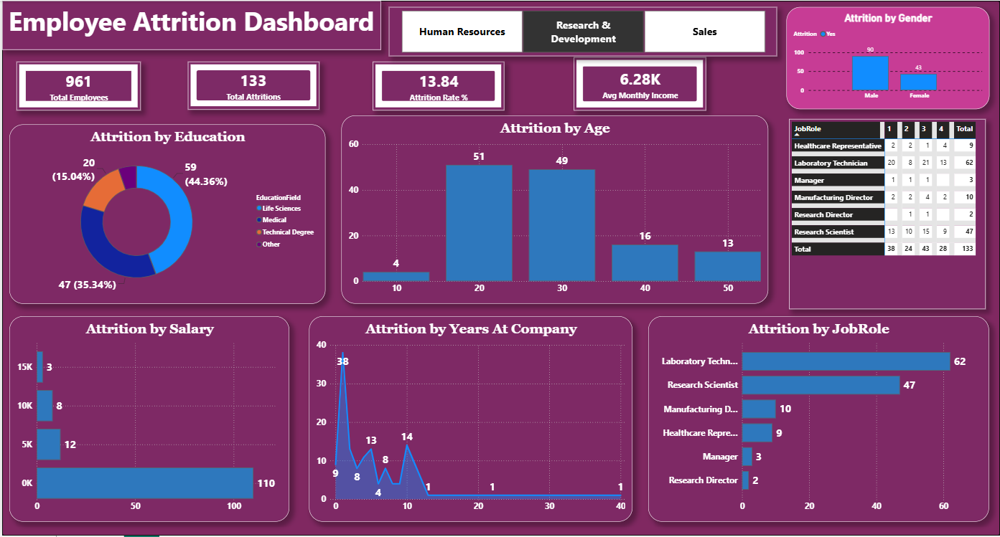

# HR Employee Attrition Analysis

## Objective
Identify key factors driving employee attrition and present them in an interactive dashboard.

## Dataset
IBM HR Analytics Employee Attrition Dataset (Kaggle), 1,470 employees, 35 columns.

## Tools Used
Python (Pandas, Matplotlib, Seaborn, SciPy), SQL (SQLite), Power BI

## Approach
1. Data cleaning: checked nulls and duplicates, dropped constant/ID columns
2. EDA: attrition by department, age, income, job role, tenure
3. Statistical testing: chi-square (Department, OverTime), t-test (MonthlyIncome)
4. SQL: GROUP BY, window functions, CTEs
5. Power BI dashboard with KPI cards and filters

## Key Insights
- Overall attrition rate: 13.84% (133 of 961 employees) — filtered department view
- Employees with lower monthly income and salary band ₹0–5K show the highest attrition (110 employees)
- Age group 20–30 accounts for the majority of attritions (100 of 133)
- Laboratory Technician and Research Scientist roles have the highest attrition counts (62 and 47)

## Dashboard

